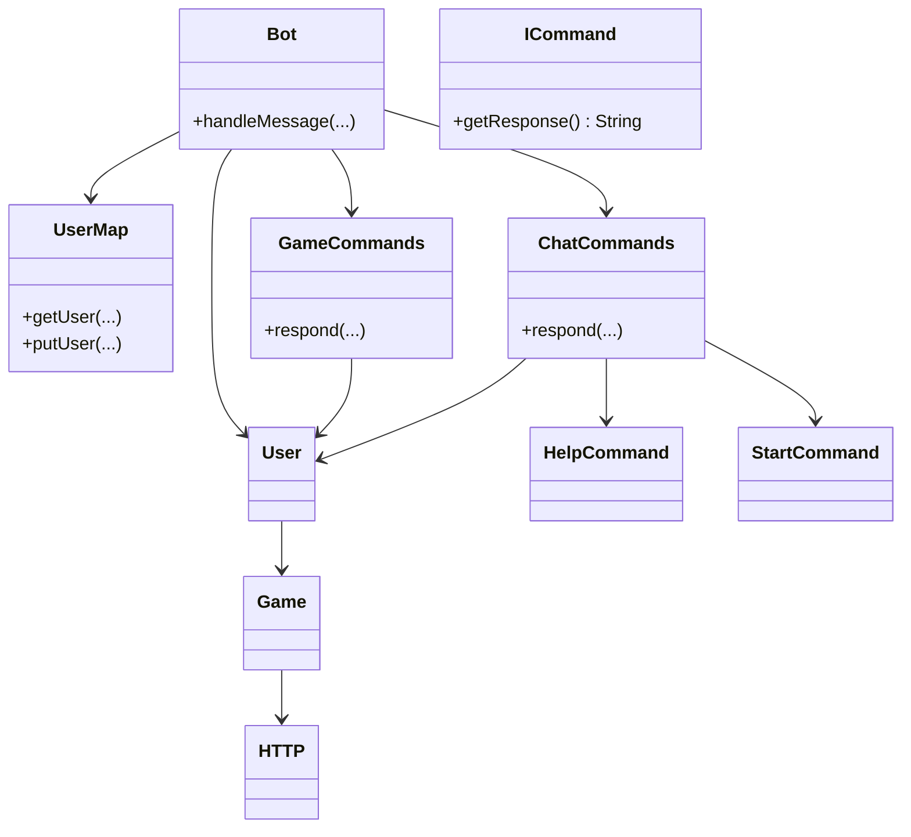

# chat-bot-java

```mermaid
classDiagram
class Bot {
    +handleMessage(...)
}
class UserMap {
    +getUser(...)
    +putUser(...)
}
class GameCommands {
    +respond(...)
}
class ChatCommands {
    +respond(...)
}
class ICommand {
    +getResponse() String
}
Bot --> UserMap
Bot --> User
Bot --> ChatCommands
Bot --> GameCommands
ChatCommands --> HelpCommand
ChatCommands --> StartCommand
User --> Game
GameCommands --> User
ChatCommands --> User
Game --> HTTP
```
