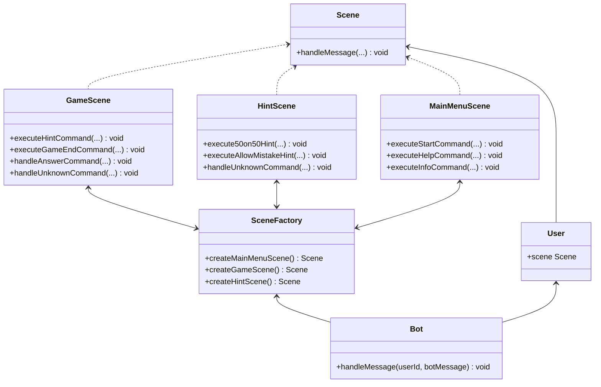

# Who want to be a millionaire – telegram-bot



## Run

1. Clone to your machine this repository
2. Open terminal inside this repository
3. run commands replacing "path_to_repo" with path to this repo on your computer:

```
javac -d bin -cp "path_to_repo/lib/telegrambots-6.1.0-jar-with-dependencies.jar:path_to_repo/lib/gson-2.9.1.jar" Bot.java GameScene.java HintScene.java IBotApi.java IScene.java MainMenuScene.java Question.java SceneFactory.java TgBotApi.java TgBotProgram.java Update.java User.java TgButtons.java AssistScene.java BotMessage.java Buttons.java CallScene.java IQuestionProvider.java JsonQuestionProvider.java
cd bin
java -cp ".:path_to_repo/lib/telegrambots-6.1.0-jar-with-dependencies.jar:path_to_repo/lib/gson-2.9.1.jar" TgBotProgram
```

## Usage

Type `/help` to see help botMessage
