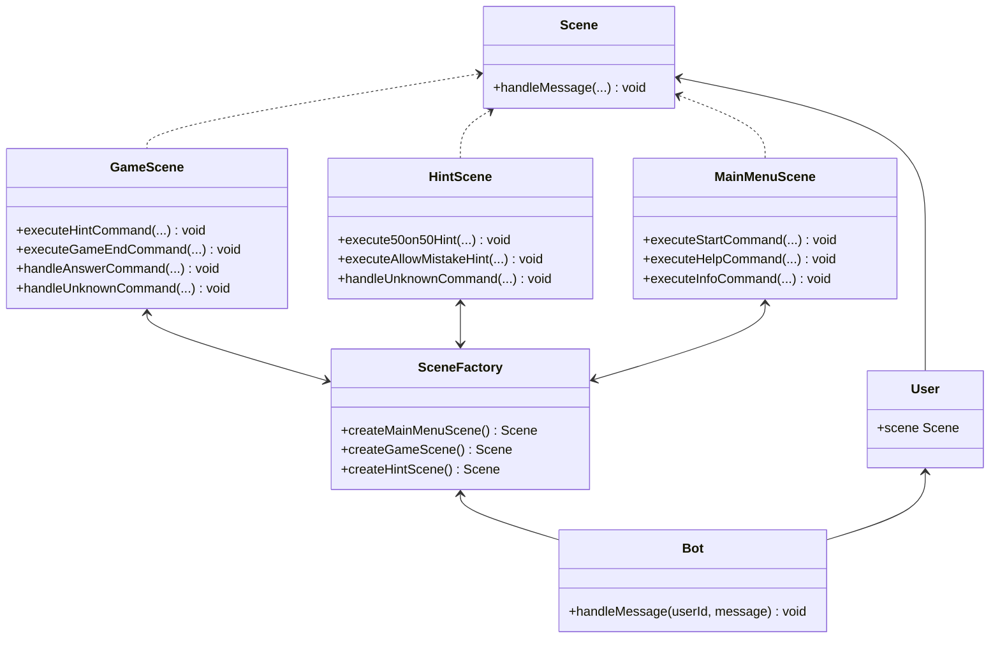

# chat-bot-java

```mermaid
classDiagram
class Scene {
    +handleMessage(...) void
}
class SceneFactory {
    +createMainMenuScene() Scene
    +createGameScene() Scene
    +createHintScene() Scene
}
class GameScene {
    +executeHintCommand(...) void
    +executeGameEndCommand(...) void
    +handleAnswerCommand(...) void
    +handleUnknownCommand(...) void
}
class MainMenuScene {
    +executeStartCommand(...) void
    +executeHelpCommand(...) void
    +executeInfoCommand(...) void
}
class HintScene {
    +execute50on50Hint(...) void
    +executeAllowMistakeHint(...) void
    +handleUnknownCommand(...) void
}
class User {
    +scene Scene
}
class Bot {
    +handleMessage(userId, message) void
}


Scene <.. GameScene
Scene <.. HintScene
Scene <.. MainMenuScene
GameScene <--> SceneFactory
HintScene <--> SceneFactory
MainMenuScene <--> SceneFactory
Scene <-- User
SceneFactory <-- Bot
User <-- Bot
```
